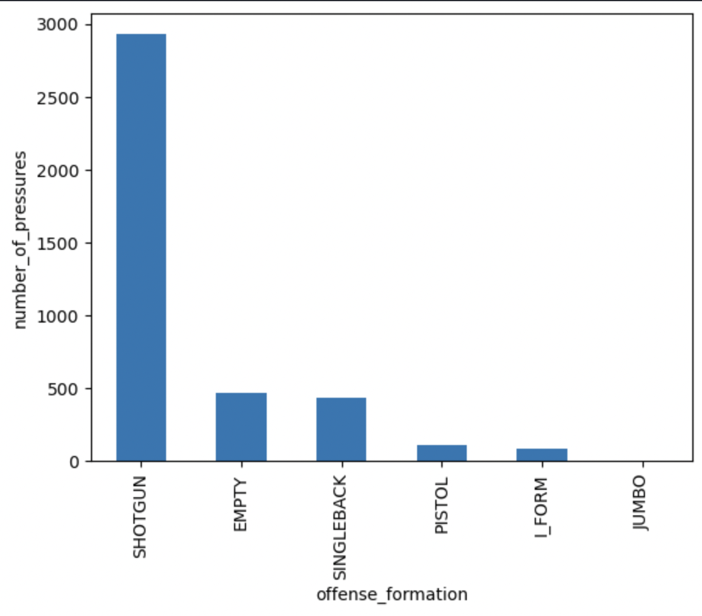
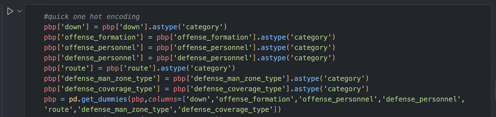
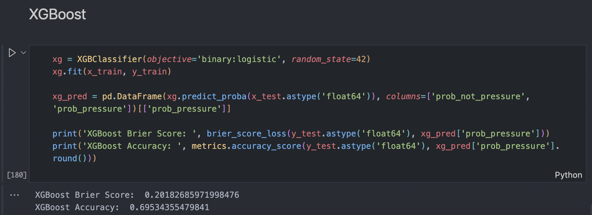
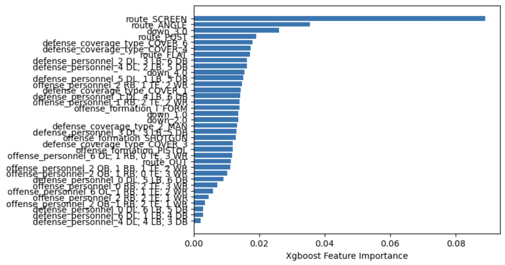

# [rodjovit.github.io](https://rodjovit.github.io/)

# Table of Contents

1. [Technical Portfolio by Rodjovit Ramos](#technical-portfolio-by-rodjovit-ramos)
2. [Professional Projects](#professional-projects)
   - [Product Delay Notifications](#product-delay-notifications)
   - [Manual Loads Application](#manual-loads-application)
   - [Platform Migration](#platform-migration)
   - [ETL Pipelines](#etl-pipelines)
4. [2023 NFL Machine Learning Analysis](#2023-nfl-machine-learning-analysis)
5. [Kaggle Machine Learning What's Cooking Contest](#kaggle-machine-learning-whats-cooking-contest)
6. [2018 VAST MC3 Data Visualization Project](#2018-vast-mc3-data-visualization-project)
7. [Multinomial Naive Bayes Classification (on tweets)](#multinomial-naive-bayes-classification-on-tweets)
8. [K Means Clustering (on articles)](#k-means-clustering-on-articles)
9. [Data Mining](#data-mining)
   - [CNN Scraper](#cnn-scraper)
10. [Data Cleaning](#data-cleaning)
   - [Article Cleaner](#article-cleaner)
11. [SQL/Relational Databases](#sqlrelational-databases)
   - [2022 NFL QB and WR Stats Database](#2022-nfl-qb-and-wr-stats-database)

---

## Techinical Portfolio by Rodjovit Ramos
This is a technical portfolio of work that I have done in regards to programming and data science concepts.

## Professional Projects
### .NET Applications

#### Product Delay Notifications
Using .NET 4.8 Framework, the goal of this project was to streamline internal operations within my company by creating an application that handles common manual functions that requires human intervention from the Order Entry department. This application used a WinForms structure/a simple GUI interface to handle form generation. Forms were created in pure HTML to sustain adaptability and compatibility across different email platforms. SQL queries involving CTEs, subqueries, cursors and more were used to retrieve data that would be cleaned/formatted and then injected into the HTML that would eventually be automated via email using PowerShell scripting. As a result, the project became fully automated via PowerShell scripting, and is triggered using different metrics to determine which form to produce and send.

#### Manual Loads Application
Using .NET 8 Framwork (with Blazor), the goal of this project was to create an application that handles common manual functions that requires human intervention from the Logistics department. This application used a Blazor pages structure to provide main functionality. Functionality included retrieving data given certain criteria designated by the user, updating data within the database, and adding data within the database. Many visual features were implemented for quality of life enhancements such as highligting certain data points that didn't match the requirements for the required action, highlighting newly created data points by the user, implementing visual numerical metrics to keep track of data selection, and many more. As a result, this project was able to streamline a large portion of shipment handling, exponentially reducing time taken to do so manually.

### Other Projects

#### Platform Migration
An overhaul of systems included migrating certain applications and portals from .NET Framework 4.8 and below to the newer .NET 8 Framework (with Blazor). Over the course of 2 months, the team developed in an Agile methodology, meeting daily for check ins and monthly for overall updates. Using a Sprint-type of workflow, the team was able to successfully migrate the system(s) needed over to .NET 8 Framwork (with Blazor). Languages inclucded C#, JavaScript, HTML, CSS, and SQL.

#### ETL Pipelines
Multiple smaller projects included the implementation of ETL pipelines. Data was received typically in XML format. Using Python libraries to parse the XML such as BeautifulSoup and Pandas, the project proceeded with data cleaning and formatting in order to satisfy database requirements. Once the data was cleaned, it was then inserted and validated directly from the database using SQL queries. Once passing the validation function, the project may be automated using PowerShell scripting for further data wrangling.

## [2023 NFL Machine Learning Analysis](https://github.com/rodjovit/rodjovit.github.io/blob/38caea52ab4b0d050ebede5b8060666a820fe06b/nfl_code/machine_learning_2023nfl_data.ipynb)
The goal of this project was to implement a machine learning model that would accurately predict whether a defense would pressure a quarterback given a number of variables. Using libraries such as sklearn, xgboost, matplotlib, and Pandas, I was able to gain plenty of insight as to what variables are important versus others when blitzing. Firstly, the analysis started with superficial knowledge of a typical pressure situation. This would lead to Part I of the project.

  

After using some matplotlib to plot certain metrics to gain insight, it was then time to prepare the data, beginning Part II. Using variables that had anomaly-like behavior seen in histograms, preparing the data would require some data manipulation techniques. In this case, I used one hot encoding with Pandas to transform data into categorical data. 

  

After this step, the data was cleaned further and finally ready for to be fed into a few models leading to Part III. The first model implemented was the XGBoost model. This model had an accuracy score of 70%, and a Brier Score of 0.202. The next model tested was the Logistic Regression model. This model had an accuracy score of 72%, and a Brier Score of 0.194. Finally, the last model to be tested was the Random Forest model. This model had an accuracy score of 67%, and a Brier Score of 0.225.

  

To finish off the analysis, I decided to visualize which variables held the most weight in the probability. Therefore, I used matplotlib to plot the feature importance for each feature.

  

## [Kaggle Machine Learning What's Cooking Contest](https://github.com/rodjovit/rodjovit.github.io/tree/3e36df2b5a2acb123fc3d627e60d0a498a536a40/kaggle_whats_cooking)
This project was done for a Kaggle Contest. In short, the task was to implement a machine learning model that would predict the nationality of a dish given it's ingredients. There was a training and testing dataset provided. In order to accomplish this task, I decided to implement a K-Nearest Neighbor model using sklearn. Also, I decided to implement some other clustering models such as HDBSCAN, Gaussian Mixture, Spectral Clustering and Birch to test accuracies, but ultimately ended up using K-Nearest Neighbor.

  

After testing the model on the testing dataset, the overall accuracy of the model was 82%. To visualize accuracy of the model, I also implemented a confusion matrix from sklearn.

  

## [2018 VAST MC3 Data Visualization Project](https://github.com/rodjovit/rodjovit.github.io/tree/4b49415e6f39fa94aa3cdc2609671dd8e7fd0fb1/2018VAST_MC3)
Utilizing data visualization tools such as Tableau and D3, the purpose of this project was to:

 * analyze company interactions over time including calls, emails, meetings, and purchases
 * analyze "suspicious" company interactions over time (given a separate flagged dataset)
 * identify additional "suspicious" employees not outlined in the briefing dossier
 * identify "suspicious" subgroups within the outlined suspicious group based on interactions
 

  

Using OpenRefine and Pandas, I was able to clean and transform the data into a useable form for Tableau and D3. After cleaning the large datasets, I used data visualization tools to not only analyze company interactions over time, but also the suspicious interactions over time, as well as identify an additional "suspicious" employee and map out their methods of interactions. I was also able to identify changes in their interactions that corroborated with the timing of the investigation.

  

  
> 
> This is just a screenshot of the interactive D3 graph. To interact with the graph, visit the html page [_here_](https://rodjovit.github.io/2018VAST_MC3/q3.html)

## [Multinomial Naive Bayes Classification (on tweets)](https://github.com/rodjovit/rodjovit.github.io/tree/c4a8da6adbdecd1073fa5fe0d2f64a2d4af84bf0/multinomialNB_tweets)

  

The purpose of this project was to implement a machine learning model to classify the sentiment of tweets. The dataset given needed to be cleaned and trasnformed (done with Python) into a useable form before being fed to the model. The classification model chosen for this application was the Multinomial Naive Bayes Classification model using the sklearn module, and classifies tweets as positive or negative based on the context. As a result, the model was able to classify the tweets with a 78% accuracy.

## [K Means Clustering (on articles)](https://github.com/rodjovit/rodjovit.github.io/tree/c4a8da6adbdecd1073fa5fe0d2f64a2d4af84bf0/kMeansClustering_articles)

  

The purpose of this project was to implement a machine learning model to cluster cleaned article data. The clustering model chosen for this application was the K Means Clustering model using the sklearn module and clusters articles based on their Term Frequency/Inverse Document Frequency (TFIDF) vector value and it's distance from the centroid TFIDF value. As a result, the model was able to cluster the articles with accuracy.

## Data Mining
### [CNN Scraper](https://github.com/rodjovit/rodjovit.github.io/tree/c4a8da6adbdecd1073fa5fe0d2f64a2d4af84bf0/cnn_scraper)

  

The purpose of this project was to scrape links, headlines, published dates, authors, and article content from CNN, more specifically the Science and Tech genres. Utilizing BeautifulSoup to parse the HTML, I was able to scrape articles (limited for ethical reasons) and prepare them for sentiment analysis using Python. As a result, the program outputs the headline, content, author, published date, and published location for every article it was able to access.

  

## Data Cleaning
### [Article Cleaner](https://github.com/rodjovit/rodjovit.github.io/tree/c4a8da6adbdecd1073fa5fe0d2f64a2d4af84bf0/text_cleaner)

This project is part of the article analysis project. This stage of the analysis utilized the Natural Language Toolkit (nltk) library to parse through the strings and clean the data. Removing stopwords, stemming and lemmatizing words, and converting symbols into text was done in Python in order to prepare the data for analysis. As a result, the script outputs a txt file of the all the article data cleaned using the nltk library. Cleaning methods includes removing:
  * stopwords
  * punctuation
  * numbers
  * single character words
  * contractions (and converting them into bigrams)
  * .com
  * non-printable characters
  * non-ascii characters
  * duplicate words in each sentence

## SQL/Relational Databases
### [2022 NFL QB and WR Stats Database](https://github.com/rodjovit/rodjovit.github.io/tree/60808f04beaa13f5b2cc832211b83fd081c6dc65/2022nfl_database)

The purpose of this project was to analyze stats recorded for every wide receiver and quarterback in the 2022 NFL season. This project utilized relational databases concepts as well as SQL programming in both data defining and data manipulation languages (DDL and DML). This project is a fleshed out database for stats for every NFL conference, division, team, quarterback, and wide receiver. It contains tables for these entities as well as the necessary bridging tables needed for relational databases.

The tables attributes consist of:
  * for Conferences:
    * Name
    * Win/Loss Record
  * for Divisions:
    * Conference
    * Name
    * Win/Loss Record
  * for Teams:
    * Conference
    * Division
    * Name
    * City
    * Mascot
    * Win/Loss Record
  * for Quarterbacks:
    * Conference
    * Division
    * Team
    * First Name
    * Last Name
    * Pass Yards
    * Rush Yards
    * Pass Attempts
    * Passes Completed
    * Completion Percentage
    * Yards Per Completion
    * Win/Loss Record
  * for Wide Receivers:
    * Conference
    * Division
    * Team
    * First Name
    * Last Name
    * Yards
    * Targets
    * Receptions
    * Touchdowns
    * Catch Percentage
    * Yards Per Reception
    * Win/Loss Record
      
As a result, I was able to use SQL queries to pull data for analysis, and gain much insight to the success of a team in regards to their quarterback's and wide receiver's performances. I was also able to gain secondary insights such as a division's success and a conference's success in regards to the quarterbacks and wide receivers in those divisions/conferences. Not only did the tables outline good performances, they also outlined bad performances which allowed for analysis pertaining to failures of a team based on quarterback and wide receiver performances. 

