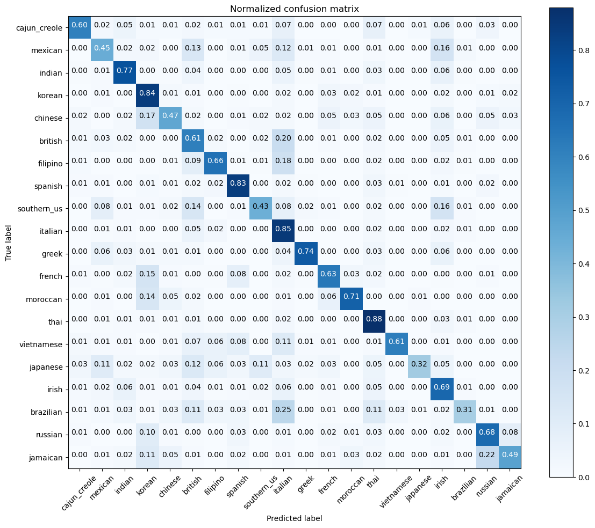

# rodjovit.github.io

## Techinical Portfolio by Rodjovit Ramos
This is a technical portfolio of work that I have done in regards to programming and data science concepts.

## [Kaggle What's Cooking Contest](https://github.com/rodjovit/rodjovit.github.io/tree/3e36df2b5a2acb123fc3d627e60d0a498a536a40/kaggle_whats_cooking)
This project was done for a Kaggle Contest. In short, the task was to create a machine learning model that would predict the nationality of a dish given it's ingredients. There was a training and testing dataset provided. In order to accomplish this task, I decided to implement a K-Nearest Neighbor model using sklearn. Also, I decided to implement some other clustering models such as HDBSCAN, Gaussian Mixture, Spectral Clustering and Birch to test accuracies, but ultimately ended up using K-Nearest Neighbor.

  

After testing the model on the testing dataset, the overall accuracy of the model was 82%. To visualize accuracy of the model, I also implemented a confusion matrix from sklearn.

  

## [2018 VAST MC3 Project](https://github.com/rodjovit/rodjovit.github.io/tree/4b49415e6f39fa94aa3cdc2609671dd8e7fd0fb1/2018VAST_MC3)
Utilizing data visualization tools such as Tableau and D3, the purpose of this project was to:

 * analyze company interactions over time including calls, emails, meetings, and purchases
 * analyze "suspicious" company interactions over time (given a separate flagged dataset)
 * identify additional "suspicious" employees not outlined in the briefing dossier
 * identify "suspicious" subgroups within the company based on interactions
 

  

Using OpenRefine and Pandas, I was able to clean and transform the data into a useable form for Tableau and D3. After cleaning the large datasets, I used data visualization tools to not only analyze company interactions over time, but also the suspicious interactions over time, as well as identify an additional "suspicious" employee and map out their methods of interactions. I was also able to identify changes in their interactions that corroborated with the timing of the investigation.

  

## [Steam Reviews Analysis Project](https://github.com/rodjovit/rodjovit.github.io/tree/3e36df2b5a2acb123fc3d627e60d0a498a536a40/steam_reviews_analysis)
This project utilized concepts of data mining, data cleaning, and machine learning to predict probabilities of games being good or bad given a word based on Steam data. This data was gathered using the Steam API in Python, cleaned using Pandas and OpenRefine, and used a classical Naive Bayes model to predict the probability that a game will be good or bad given a word. The output is a table that lists the amount of occurrences in good and badly reviewed games, the total amount of occurrences, and the probabilities they will be in a good or bad game, as well as the probability a game will be good given the word. Further work could include allowing for input to test different combinations of titles/genres.

  

## Machine Learning
### [Multinomial Naive Bayes Classification](https://github.com/rodjovit/rodjovit.github.io/tree/c4a8da6adbdecd1073fa5fe0d2f64a2d4af84bf0/multinomialNB_tweets)

  

The purpose of this project was to implement a machine learning model to classify the sentiment of tweets. The dataset given needed to be cleaned and trasnformed (done with Python) into a useable form before being fed to the model. The classification model chosen for this application was the Multinomial Naive Bayes Classification model using the sklearn module, and classifies tweets as positive or negative based on the context. As a result, the model was able to classify the tweets with accuracy.

### [K Means Clustering](https://github.com/rodjovit/rodjovit.github.io/tree/c4a8da6adbdecd1073fa5fe0d2f64a2d4af84bf0/kMeansClustering_articles)

  

The purpose of this project was to implement a machine learning model to cluster cleaned article data. The clustering model chosen for this application was the K Means Clustering model using the sklearn module and clusters articles based on their Term Frequency/Inverse Document Frequency (TFIDF) vector value and it's distance from the centroid TFIDF value. As a result, the model was able to cluster the articles with accuracy.

## Data Mining
### [CNN Scraper](https://github.com/rodjovit/rodjovit.github.io/tree/c4a8da6adbdecd1073fa5fe0d2f64a2d4af84bf0/cnn_scraper)

  

The purpose of this project was to scrape linkes, headlines, published dates, authors, and article content from CNN, more specifically the Science and Tech genres. Utilizing BeautifulSoup to parse the HTML, I was able to scrape articles (limited for ethical reasons) and prepare them for sentiment analysis using Python.

  

## Data Cleaning
### [Article Cleaner](https://github.com/rodjovit/rodjovit.github.io/tree/c4a8da6adbdecd1073fa5fe0d2f64a2d4af84bf0/text_cleaner)

This project is part of the article analysis project. This stage of the analysis utilized the Natural Language Toolkit (nltk) library to parse through the strings and clean the data. Removing stopwords, stemming and lemmatizing words, and converting symbols into text was done in Python in order to prepare the data for analysis. 

## SQL/Relational Databases
### [2022 NFL QB and WR Stats Database](https://github.com/rodjovit/rodjovit.github.io/tree/60808f04beaa13f5b2cc832211b83fd081c6dc65/2022nfl_database)

The purpose of this project was to analyze stats recorded for every wide receiver and quarterback in the 2022 NFL season. This project utilized relational databases concepts as well as SQL programming in both data defining and data modeling languages (DDL and DML). This project is a fleshed out database for stats for every NFL conference, division, team, quarterback, and wide receiver. It contains tables for these entities as well as the necessary bridging tables needed for relational databases. It records the wins and losses for every entity as a whole and individual, as well as many individual stats such as yards, receptions, pass attempts, etc.

